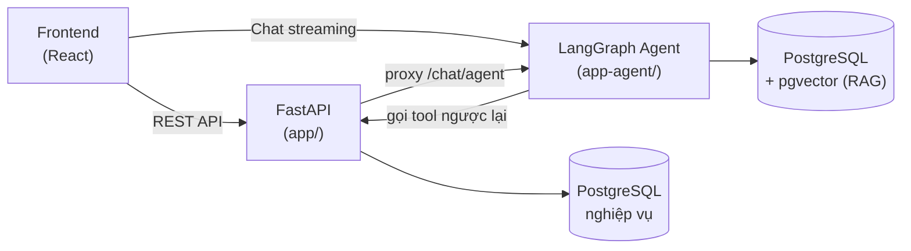

# AI-Chatbot Digital Banking — API (Backend)

Backend cho ứng dụng **ngân hàng số tích hợp trợ lý AI**. Xây bằng **FastAPI (Python 3.11)**, cung cấp REST API cho nghiệp vụ ngân hàng và một **AI Agent (RAG chatbot)** tư vấn khách hàng, xây trên **LangGraph + Google Gemini**.

> 🔗 **Frontend:** [`ai-chatbot-digital-banking-web-frontend`](https://github.com/NguyenQuyenHacker/ai-chatbot-digital-banking-web-frontend) — React + Vite.

---

## Table of Contents

- [Overview](#overview)
- [Tech Stack](#tech-stack)
- [Project Structure](#project-structure)
- [Prerequisites](#prerequisites)
- [Getting Started](#getting-started)
- [Environment Variables](#environment-variables)
- [Running the AI Agent](#running-the-ai-agent-optional)

## Overview

Hệ thống gồm 2 phần chạy độc lập, đều nằm trong repo này:

| Phần | Thư mục | Vai trò |
|---|---|---|
| **API server** | `app/` | REST API: auth, tài khoản, chuyển tiền, tiết kiệm, thống kê, knowledge base, proxy tới agent |
| **AI Agent** | `app-agent/` | LangGraph server: chatbot RAG, gọi Gemini, tìm kiếm ngữ nghĩa trên `pgvector` |

Luồng hoạt động:



## Tech Stack

| Nhóm | Công nghệ |
|---|---|
| Web framework | FastAPI (Python 3.11) |
| ORM / models | SQLModel, SQLAlchemy |
| Database | PostgreSQL + `pgvector` |
| Driver | psycopg, asyncpg |
| Auth | JWT (python-jose), bcrypt |
| AI Agent | LangGraph, LangChain, Google Gemini |
| Server | Uvicorn |

## Project Structure

```
my-app-BE/
├── app/                        # FastAPI application
│   ├── main.py                 # Khởi tạo app, CORS, mount routers, background jobs
│   ├── routers/
│   │   ├── client/             # API khách hàng: auth, account, transfer,
│   │   │                       #   savings, statistics, quota, agent_proxy...
│   │   └── admin/              # API admin: auth, quản lý user, knowledge base
│   ├── services/               # Business logic (tách khỏi router)
│   ├── crud/                   # Thao tác CRUD với DB
│   ├── models/                 # SQLModel models (account, customer, transfer,
│   │                           #   savings, knowledge_base, user_thread...)
│   ├── schemas/                # Pydantic schemas (request/response)
│   ├── db/
│   │   └── database.py         # Engine + session (DB nghiệp vụ & DB admin/vector)
│   ├── core/                   # Config, constants (AGENT_URL...)
│   ├── dependencies.py         # Dependency injection (current user, session...)
│   ├── jobs/                   # Background jobs (reconcile, savings maturity)
│   └── utils/                  # Helper dùng chung
├── app-agent/                  # LangGraph AI Agent (chạy riêng)
│   ├── my_agent/
│   │   ├── agent.py            # Định nghĩa graph
│   │   ├── src/tool/           # Tools: account, transfer, search
│   │   └── prompts/            # System prompt
│   ├── langgraph.json          # Cấu hình LangGraph
│   └── requirements.txt
├── scripts/                    # SQL phụ trợ (savings, transfer_sessions)
├── requirements.txt
└── .env.example                # Mẫu biến môi trường
```

**Kiến trúc phân tầng** của API: `router → service → crud → model`. Router chỉ nhận request và trả response; logic nghiệp vụ nằm ở `services/`; truy cập DB gom ở `crud/`.

## Prerequisites

- **Python 3.11**
- **PostgreSQL** — 2 database:
  - DB nghiệp vụ chính (`DATABASE_URL`)
  - DB cho RAG có bật extension **`pgvector`** (`DATABASE_URL_ADMIN`)
  - > Có thể trỏ tới PostgreSQL cloud (Neon) đã có sẵn bảng, hoặc PostgreSQL cài local.
- **Google Gemini API key** — lấy tại https://aistudio.google.com/apikey

## Getting Started

```bash
# 1. Clone repo về máy
git clone https://github.com/NguyenQuyenHacker/ai-chatbot-digital-banking-web-backend.git
cd ai-chatbot-digital-banking-web-backend

# 2. Tạo & kích hoạt virtual environment (Python 3.11)
python -m venv .venv
.venv\Scripts\activate           # Windows (PowerShell)
# source .venv/bin/activate      # macOS / Linux

# 3. Cài dependencies
pip install --upgrade pip
pip install -r requirements.txt

# 4. Tạo file .env từ mẫu, rồi mở ra điền giá trị
copy .env.example .env           # Windows
# cp .env.example .env           # macOS / Linux

# 5. Chạy server (hot reload)
uvicorn app.main:app --reload --port 8000
```

Sau khi chạy:
- API base: **http://localhost:8000**
- Swagger UI (tài liệu API tương tác): **http://localhost:8000/docs**
- ReDoc: **http://localhost:8000/redoc**

> 💡 **Windows**: `app/main.py` đã tự chuyển sang `WindowsSelectorEventLoopPolicy` để tránh lỗi psycopg với ProactorEventLoop — không cần cấu hình thêm.

## Environment Variables

Điền trong file `.env` (tham khảo [`.env.example`](./.env.example)):

| Biến | Bắt buộc | Mô tả |
|---|:---:|---|
| `DATABASE_URL` | ✅ | Chuỗi kết nối PostgreSQL cho nghiệp vụ chính |
| `DATABASE_URL_ADMIN` | ✅ | PostgreSQL (bật `pgvector`) cho RAG. Dùng driver `postgresql+psycopg://` |
| `GOOGLE_API_KEY` | ✅ | Google Gemini API key |
| `JWT_SECRET_KEY` | ✅ | Secret ký JWT (chuỗi ngẫu nhiên, vd `openssl rand -hex 32`) |
| `DB_ECHO` | ❌ | `true` để log SQL khi debug (mặc định `false`) |
| `AGENT_URL` | ❌ | URL LangGraph agent để chat (mặc định `http://localhost:8123`) |
| `CORS_ORIGINS` | ❌ | Origin frontend được phép, cách nhau bằng dấu phẩy (mặc định `http://localhost:5173`) |

## Running the AI Agent (Optional)

Chỉ cần khi muốn thử tính năng **chat với trợ lý AI**. Agent chạy riêng bằng LangGraph CLI:

```bash
cd app-agent

# Cài dependencies của agent
pip install -r requirements.txt

# Tạo .env cho agent (GOOGLE_API_KEY, VECTOR_DB_URL, API_BASE_URL...)

# Chạy LangGraph dev server (đặt port khớp với AGENT_URL của backend)
langgraph dev --port 8123
```

`langgraph dev` mặc định chạy ở port **2024**; ở đây đặt `--port 8123` để khớp giá trị mặc định `AGENT_URL` của backend. Đảm bảo `AGENT_URL` trong `.env` backend trỏ đúng địa chỉ agent (`http://localhost:8123`) thì endpoint `/chat/agent/*` mới hoạt động.

---

<sub>Đồ án học tập — API ngân hàng số kết hợp trợ lý AI (RAG).</sub>
